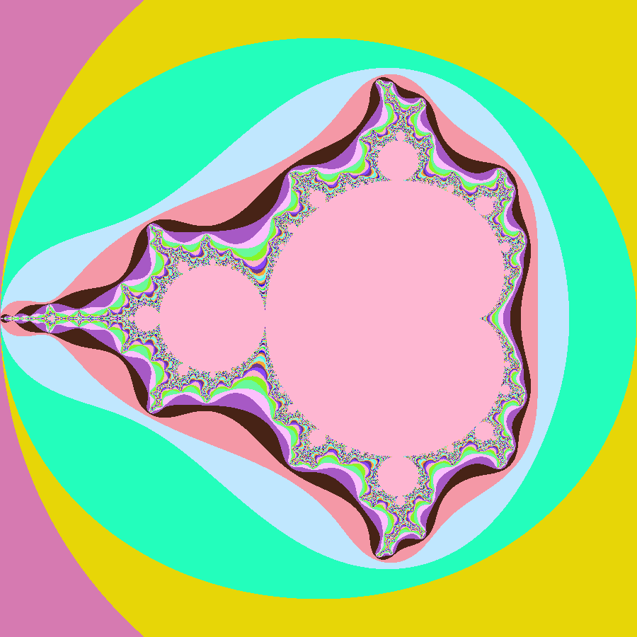

# Mandelbrot Set Renderer

This is a simple Mandelbrot set renderer written in Rust. The Mandelbrot set is a particular set of complex numbers with unique fractal properties. When visualized, it creates beautiful patterns and shapes.



## How it Works

1. We define a range in the complex plane for which we want to visualize the Mandelbrot set.
2. For each pixel in our image, we map it to a corresponding point in the complex plane.
3. For each of these complex numbers, we iterate a function to see if the result will "escape" to infinity or stay bounded.
4. The number of iterations taken for each point determines its color on the image.

## Usage

To generate an image of the Mandelbrot set:

```bash
cargo run
```

## Behind the Scenes

- **Complex Number Handling**: With the aid of the `num_complex` crate, we effortlessly handle and operate with complex numbers, crucial for the Mandelbrot set computations.

- **Creating the Image**: The `image` crate plays a pivotal role in formulating and preserving the fractal's visual representation.

- **Color Strategy**: Each pixel's color is determined by a gradient function, which uses the Mandelbrot iteration count. Trigonometric functions help in achieving a visually appealing color gradient.

## Acknowledgment

A tip of the hat to [this insightful article](https://www.keiruaprod.fr/blog/2021/05/15/mandelbrot.html). It dives deep into the intricate beauty and principles of the Mandelbrot set.

---

